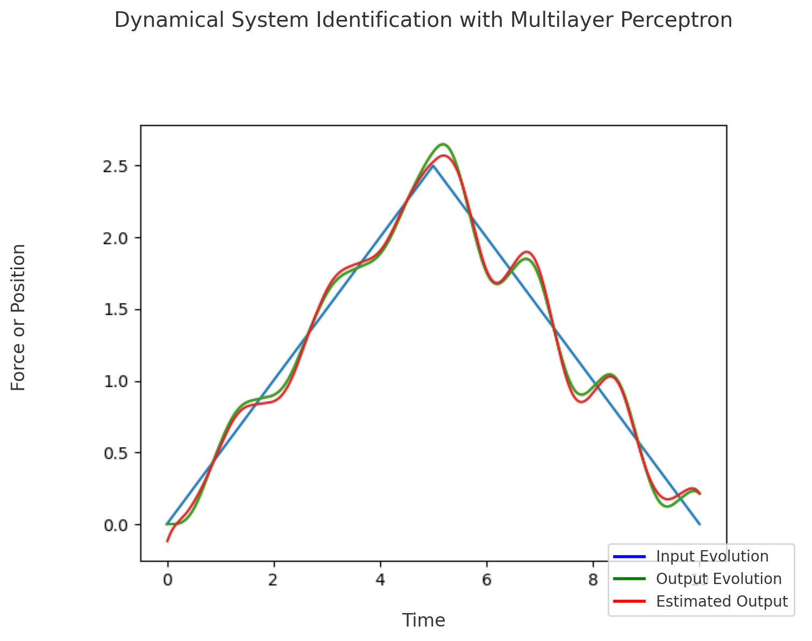

# Neural Networks for Dynamic System Identification

## 📌 Project Goal

The goal of this project is to learn a function that maps the next output of a dynamical system based on its previous outputs and previous inputs. This task is essential for understanding and predicting the behavior of systems that evolve over time and are influenced by their past states and external inputs. 

## 🛠️ What Has Been Done

This project involves the implementation from scratch of two types of neural networks: a multilayer perceptron (MLP) and a fully connected network using radial basis functions (RBF) as activation functions. The implementation from scratch of neural networks is today completely unuseful with all the existing libraries (scikit-learn, pytorch, keras etc...), but it was interesting to do it to better understand the maths behind the backpropagation.  

These networks were first tested on simple one-dimensional functions to compare their performance in terms of speed and accuracy. Then, they were applied to a simulated physical system: a one-dimensional mass subject to external force and nonlinear friction. The input data (stored in `force.mat`) represents the time series of forces applied to the mass, while the output data (stored in `position.mat`) contains the resulting position over time. The friction is modeled as a combination of Coulomb (static) friction and viscous (velocity-dependent) damping, which introduces non-linearity and memory effects in the system's behavior. The goal of the neural networks is to identify the underlying dynamics of this system from data alone.

## 📊 Results Summary

The results from the experiments on simple functions show that the MLP tends to be faster and generally more accurate than the RBF-based network. However, for certain types of functions, such as sinusoidal waves, the RBF network performs better, likely due to its localized activation behavior. When applied to the dynamic system data, both networks produce similar results, indicating that they are equally capable of capturing the underlying system dynamics, particularly in the context of friction modeling. Bellow you can see the estimation of the dynamical system by the neural network over time : 

